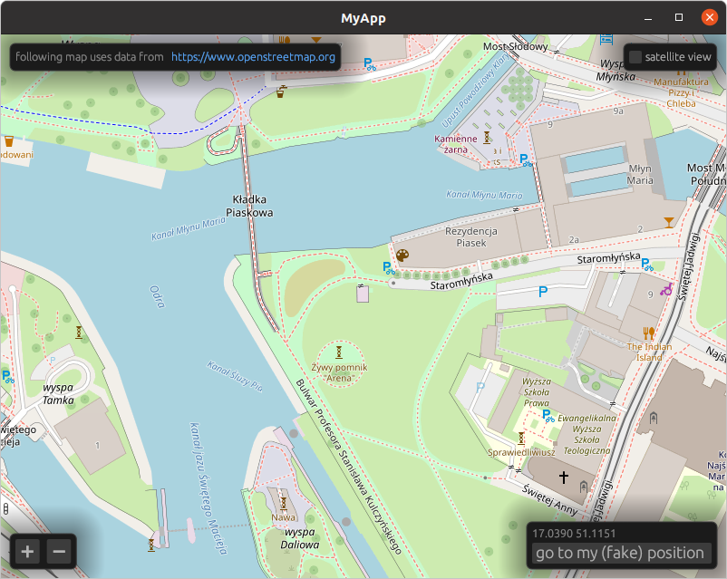

[](https://crates.io/crates/walkers)

Slippy maps widget for [egui](https://github.com/emilk/egui).

# Quick start

Walkers widget needs two objects which are stored somewhere in the application.

```rust
struct Osm {
    tiles: Tiles,
    map_memory: MapMemory,
}

impl Osm {
    fn new(egui_ctx: Context) -> Self {
        Self {
            tiles: Tiles::new(egui_ctx),
            map_memory: MapMemory::default(),
        }
    }
}
```

Once this is done, you can simply add `Map` widget to the `update` method:

```rust
ui.add(Map::new(
    Some(&mut self.tiles),
    &mut self.map_memory,
    my_position,
));
```

# Limitations

There are couple of limitations when using this library. Some of them will
might probably be lifted at some point. Please raise an issue if you are
particularly affected by some and I will try to prioritize.

* Limited to the OpenStreetMaps, but I want to enable other tile servers and
  protocols (like WMS) as well.
* It uses `reqwests`/`tokio` stack which does not work on WASM.
* Example for Android is missing, but it does work there.

Other suggestions are welcomed as well.


